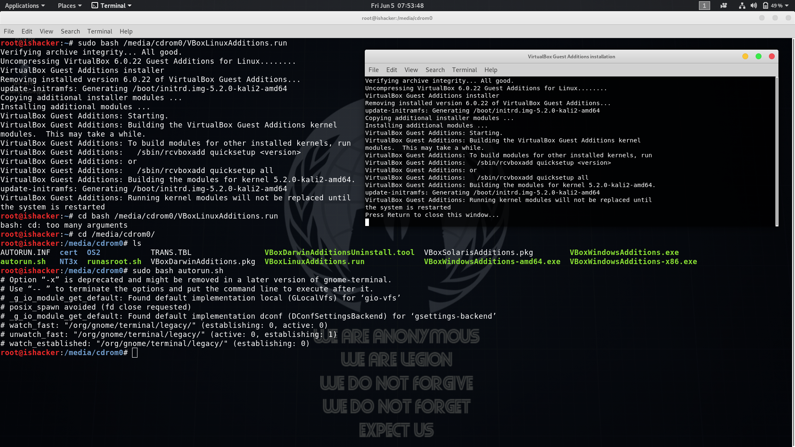

## VirtualBox Can't Maximize The Screen
### Solution
1. First step : download the [VBoxGuestAdditions_5.0.14.iso](http://download.virtualbox.org/virtualbox/5.0.14/VBoxGuestAdditions_5.0.14.iso)

2. Second step : move the `VBoxGuestAdditions_5.0.14.iso` file into your shared folder then unzip it.

3. Third step : into the shared folder of windows operation then execute this commands be shown as below :
> cd  /media/cdrom0/

> sudo bash VBoxLinuxAdditions.run

> sudo bash autorun.sh

4. Last step : restart your computer

